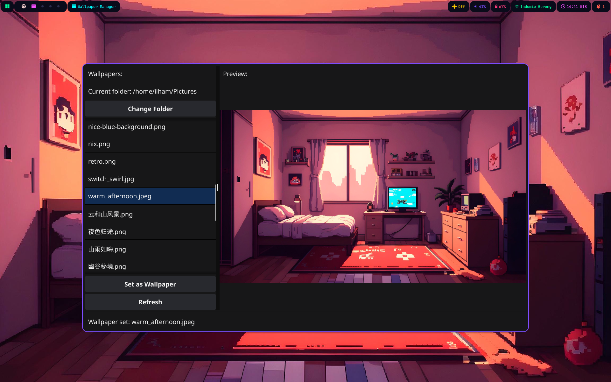

# Wallpaper Manager

A simple wallpaper manager for Wayland using the [swww](https://github.com/LGFae/swww) wallpaper daemon.



## Description

Wallpaper Manager is a lightweight, user-friendly application that provides a graphical interface for selecting and applying wallpapers in Wayland environments. It integrates seamlessly with the `swww` daemon to enable smooth wallpaper transitions and ensures your wallpaper selection persists across sessions.

### Features
- Intuitive graphical interface for wallpaper selection
- Smooth transitions via `swww`
- Automatic wallpaper restoration on login
- Easy integration with NixOS and Home Manager

## Installation

### Using Nix Flakes (Recommended)

Add the flake to your inputs:

```nix
# In your flake.nix
inputs = {
  wallpaper-manager.url = "github:hambosto/wallpaper-manager";
};
```

#### NixOS/Home Manager

Enable the module in your configuration:

```nix
# In your configuration.nix or home.nix
{ inputs, ... }: {
  imports = [
    inputs.wallpaper-manager.nixosModules.default
  ];

  programs.wallpaper-manager.enable = true;
}
```

This will:
1. Install Wallpaper Manager
2. Set up systemd services for the `swww` daemon
3. Enable automatic wallpaper restoration on login

#### Standalone Installation

If you want to install the package without using the module:

```nix
# In your configuration.nix or home.nix
{ inputs, pkgs, ... }: {
  environment.systemPackages = [
    inputs.wallpaper-manager.packages.${pkgs.system}.default
  ];
}
```

### Manual Installation (Without Nix)

#### Prerequisites
- Go 1.18 or higher
- `pkg-config`
- Required X11/OpenGL development libraries

#### Build and Install

```bash
git clone https://github.com/hambosto/wallpaper-manager.git
cd wallpaper-manager
go build
sudo install -Dm755 wallpaper-manager /usr/local/bin/
sudo install -Dm644 assets/app-logo.png /usr/share/icons/hicolor/128x128/apps/wallpaper-manager.png
```

#### Create a Desktop Entry

```bash
cat > ~/.local/share/applications/wallpaper-manager.desktop << EOF
[Desktop Entry]
Type=Application
Name=Wallpaper Manager
Exec=wallpaper-manager
Icon=wallpaper-manager
Comment=A simple wallpaper selector using swww
Categories=Utility;Graphics;
EOF
```

## Usage

1. Ensure the `swww` daemon is running:
   ```bash
   swww init
   ```

2. Launch Wallpaper Manager:
   ```bash
   wallpaper-manager
   ```

3. Select your preferred wallpaper. The application will:
   - Apply the wallpaper using `swww`
   - Save the selected wallpaper path to `~/.cache/.active_wallpaper` for persistence

## Development

A development shell is available for working on the project:

```bash
# With flakes enabled
nix develop
```

## License

This project is licensed under the MIT License. See the [LICENSE](LICENSE) file for details.

